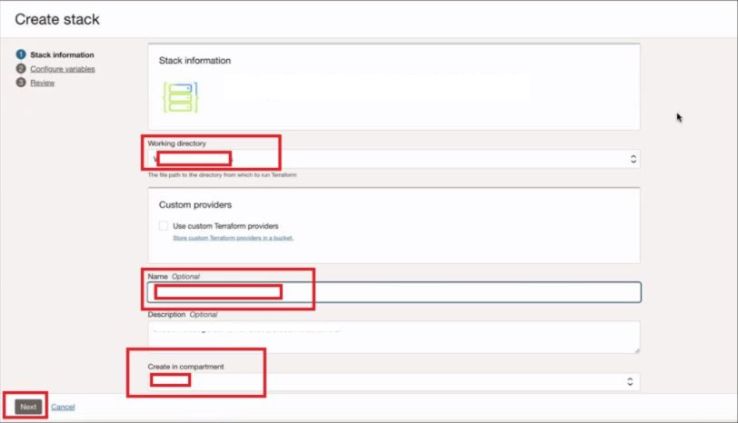
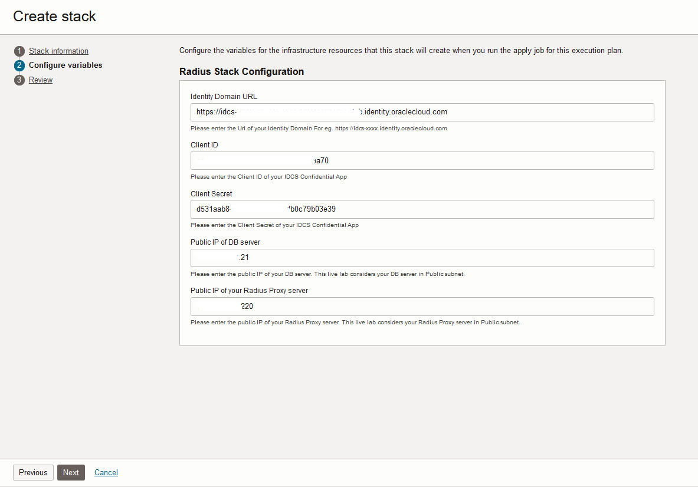
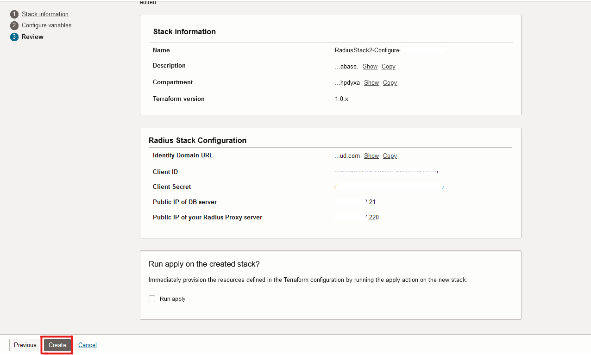
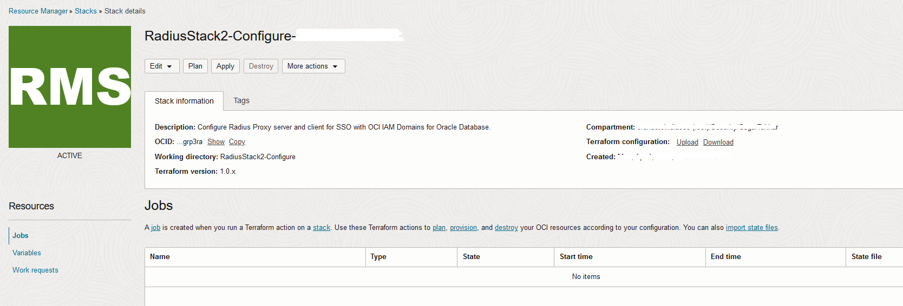
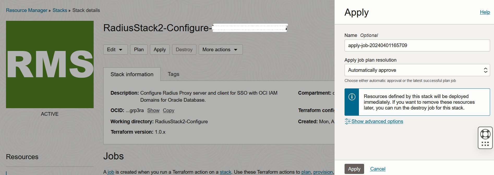
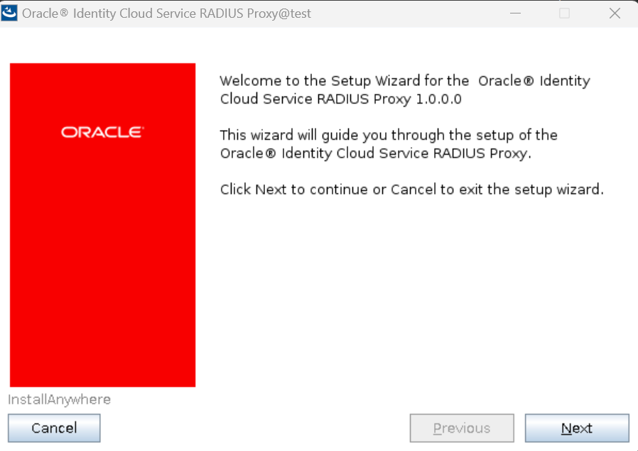
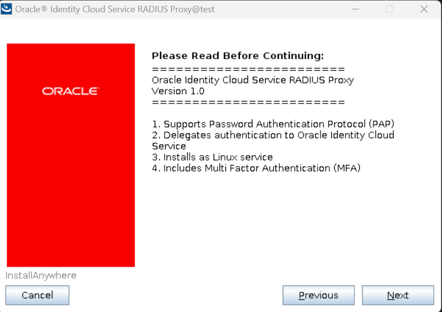
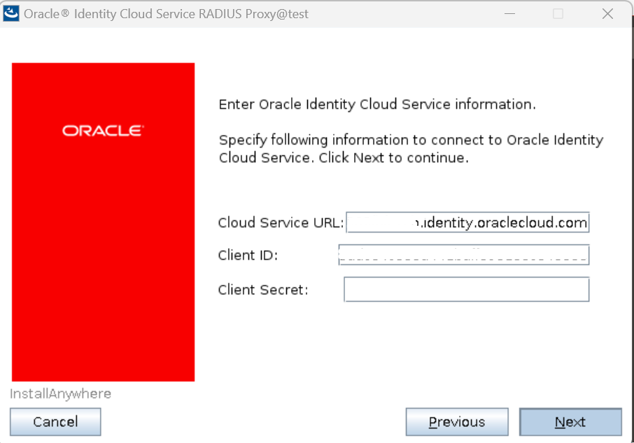
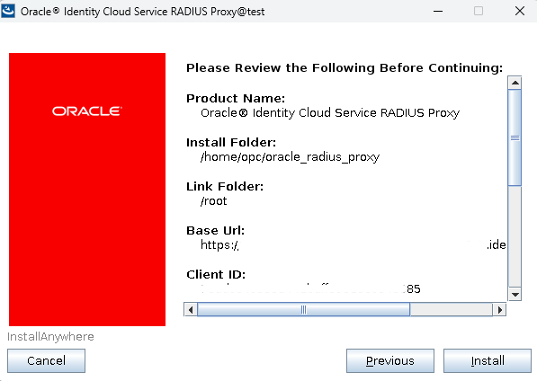

# Deploy the stack to configure Oracle Database 19c, Radius Proxy and Identity Domain

## Introduction

Using this stack we will be able to configure **Oracle Database 19c, Radius Proxy and Identity Domain**. As part of this stack, a Radius App and Radius Proxy along with Sign-on Policy will be created under **Identity Domain**.

## Objectives

1.	Configure **Oracle Database 19c server**
2. 	Configure **Radius Proxy server**
3.	Create the **Radius App** ,**Radius Proxy** and **Sign-on Policy** under **Identity Domain** 

## Prerequisites

Once the **Stack2-Configure.zip** is downloaded, unzip the zip file and replace the the content of the **.pem** files (RadiuProxy.pem and DB.pem) with your respective content of the private key.

## Task 1: Deploy the Configuration Stack via Resource Manager

1. Once logged in to OCI Console, navigate to **Developer Services** then select **Stacks** under **Resource Manager**. Now click on **Create Stack**

	
	
	

**Note** Please do not select the **Root** compartment while creating the stack
 
2. On the Create Stack Wizard, select the **Stack 2-Configure.zip** option and then browse to upload the **Deploy** stack that you downloaded in the previous lab. Now click on **Next**

	
	
	
	
	
	
**Note** The stack automatically picks up the working directory, provides the stack with a name and the working compartment gets selected. The Stack Name and Compartment can be changed if required.

3. Now, on the **Configure variables** section, fill in the below mentioned values, then click on **Next**

	1. *Public IP address of your Radius Proxy Server*
	2. *Identity Domain URL - Domain URL of the Deployed Domain . **Note** Remove **:443** from the end of the Domain URL.*
   	3. *Client ID - Please enter the Client ID of your IDCS Confidential App*
    4. *Client Secret - Please enter the Client Secret of your IDCS Confidential App*
	5. *Public IP address of your Oracle DB server - This will cone from Stack one after the DB Server will be deployed*   

	
		
4. Now on the **Review Details** check for the configurations and then click on **Create** . Make sure the **Run Apply** is not selected.

	
	
	
	
5. From the created stack now click on the **Plan** option. You should get a Success output.

	
	
6. From the created stack now click on the **Apply** option. You should get a Success output.	

	
	
**Note** The stack might take around 15 mins for execution. Please wait until the **job** succeeds.

## Task 2: Run the Radius Proxy Installer on Radius proxy server

1. Once the stack2 is completed succesfully, you need to SSH in to it using the public IP of the Radius proxy server and private key of the instance.

**Note** The tool used in this live lab for ssh is MobaXterm, If you are using any other tool, make sure it capable of providing the UI.

2. Once you have SSH in to the instance, you need to add the **xauth** cookie from the opc user to root user. You can do it with the below command from root user.
```
xauth add $(xauth -f ~opc/.Xauthority list|tail -1)
```
**Note** You might need to run this command twice as it is known to be failed for the first time. This happens on the first session after the VM is spunned. 

Just to make sure that the above command is successful, you can run the below command to see the xauth cookie and it should be same as the opc user's xauth cookie.
```
xauth list $DISPLAY
```

3. After getting the xauth cookie to the root user, navigate to path /home/opc/radiusserver to reach to the installer file of radius proxy.

4. Run the installer with below command.
```
./idcs_radius_proxy_installer.bin
```
**Note** This will bring up the installer for radius proxy.

5. Install RADIUS Proxy.
	1. Read the Welcome screen, and then click Next.
    2. Read the Information screen, and then click Next.
    3. Select the Destination Folder as /home/opc/oracle_radius_proxy, where the RADIUS Proxy installer will be installed. Click Next.
    4. On the HTTP Proxy screen, select Use HTTP Proxy if RADIUS Proxy needs to use HTTP proxy to connect to Oracle Identity Cloud Service. If not, then leave this check box unchecked. Click Next.
    5. On the Oracle Identity Cloud Service screen, enter the Cloud Service URL in the following format: https://tenant-base-url. Provide the Client ID and Client Secret of the RADIUS Proxy created in Oracle Identity Cloud Service. (This is the RADIUS Proxy you created using the POST Operation above.) Click Next. **Note** For this lab, the values client ID and client secret of Radius proxy can be found in the logs of stack2 with name **Radius Proxy Oauth Client ID** and **Radius Proxy Oauth Client Secret** respectively.
    6. On the RADIUS User and Group Information screen, provide the Username and user Group information, for example:
        Username: opc
        Group: opc
		Oracle Identity Cloud Service RADIUS Proxy daemon will run under the specified username and group.
    7. Click Next.
    8. On the pre-install screen, verify that all the information is correct. If it's correct, click Install.
    9. When the installation is complete, click Done.

	
	
	
	
	
	

6. Make sure the Radius Agent and Radius Proxy are running on the machine. You can use the below commands to restart them respectively.
```
python /home/opc/oracle_radius_proxy/radius_agent/scripts/src/radius_agent.py restart
/sbin/service idcs_radiusd restart
```
	
## Task 3: Configure Oracle Database 19c server for getting GUI mode for MFA
First thing we need to do on the DB server is to reboot it to get configurations in to the action. You can reboot the server either through portal or by running *reboot* command from sudo user on server.
 
You can follow either the step 1 or step 2 to get the pop-up on the DB server for authentication with MFA.
1. Once you have SSH in to the db instance, you need to add the **xauth cookie** from the opc user to the **oracle** user. You can do it with the below commands.
```
From OPC user:
xauth list $DISPLAY
#copy the output of this command.

From Oracle user:
xauth add <Output from previus step>
```
Also, make sure LD_LIBRARY_PATH is also set on the oracle user. below is the format for the same.
LD_LIBRARY_PATH=<Oracle_Home>/jdk/jre/lib/amd64/server:/usr/lib:<Oracle_Home>/rdbms/lib:<Oracle_Home>/jdbc/lib:<Oracle_Home>/lib

2. Alternatively, the Oracle DB instance contains the script to enable the VNC on it under the folder **/tmp/ll-setup/**. You can run the script from the root user to enable VNC to VM access.
```
./setup-novnc-livelabs.sh
```
This step will ask for the user, supply **oracle** as the user and proceed, this scipts takes around 10 minutes and once successful, it gives you the link to access the VM with full GUI mode.
**Note** Make sure that you have the LD_LIBRARY_PATH defined for the session you have taken.

## Conclusion
 
In this lab, we were able to successfully deploy and configure Oracle Database 19c, Radius Proxy Server and Identity Domain. 

 You may now **proceed to the next lab.**

## Acknowledgements
* **Author** - Sagar Takkar
* **Lead By** - Deepthi Shetty 
* **Last Updated By/Date** - Sagar Takkar March 2024


