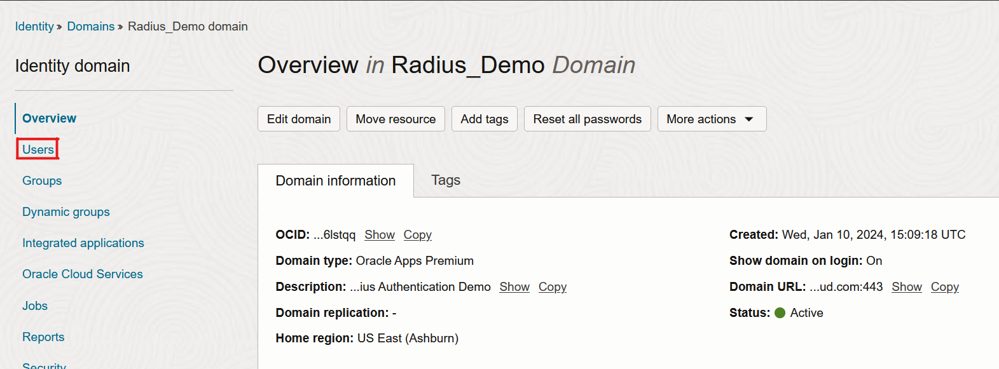
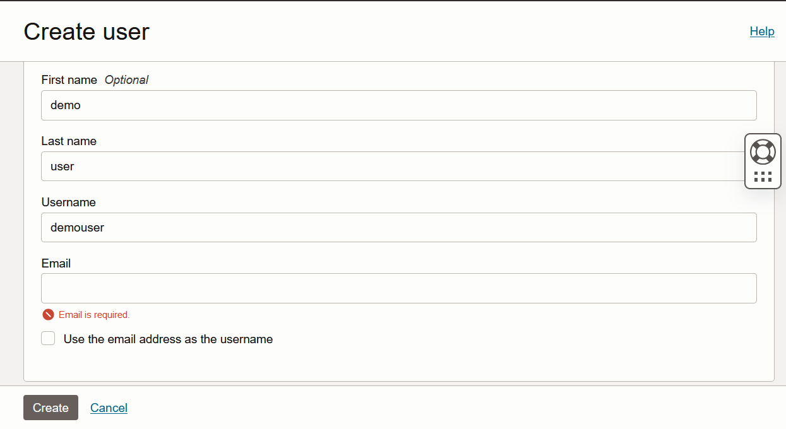
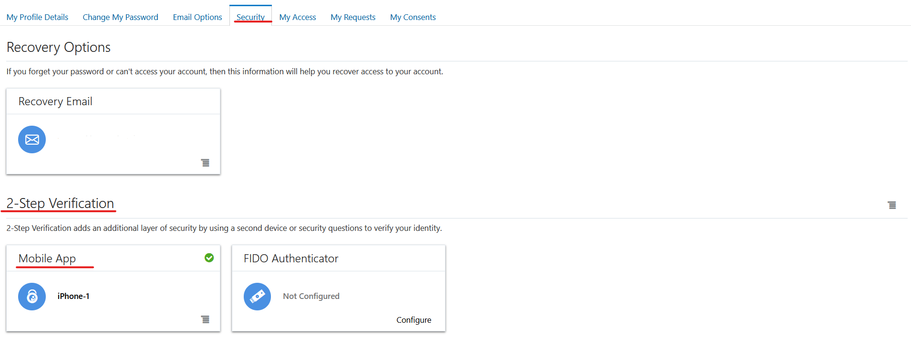
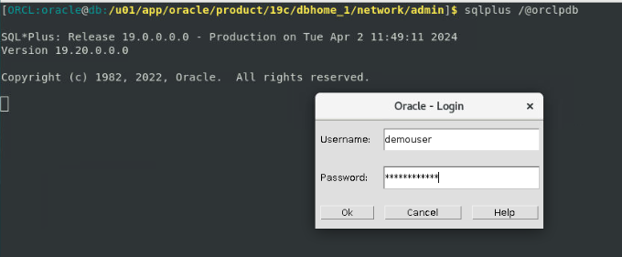

# Validate

## Introduction

This lab will show you how you can test the authentication of a **OCI IAM Identity Domains** user with MFA on Oracle Database 19c


### Objectives

-   Create and assign a **Test User** to the Radius App in the newly created **Identity Domain** *For Example- demouser*
-   Test the authentication to DB with MFA via OCI IAM Identity Domain.

## Task 1: Create an Admin User to Test the Single Sign On.

1. Navigate to newly created Identity Domain and click on **Users** option from the left hand menu

	

2. Now click on **Create User** and add the below details for the User and **Create** it.

	1. *First Name* - demo
	2. *Last Name* - user
	3. Uncheck the **Use the email address as the username**
	4. *Username* - demouser
	5. *Email* - Valid email to reset the password for this User
	
	

**Note** - The **Username** here should be the *demouser* as the same user is created in the DB as external user during the time of **Stack 2** configuration.

3. You shloud get an email to **Activate** your Admin User. Activate the user by clicking on the **Reset Password** option from the email.

4. Enable the authentication factors on the above create account.
	1. Login to Identity Domain My Apps dasboard (https://<identity_domain>/ui/v1/myconsole). 
		
	2. Click on the user icon located in the upper right corner and then select "My Profile".
	3. Click on "Security" tab.
	4. Configure authentication factors for your profile under "2-Step Verification" section.
		
		
## Task 2: Test the authentication to DB with MFA via OCI IAM Identity Domain

SSH in to the DB instance. Follow the below steps to test the authentication.

	1. sudo su - oracle
	2. **sqlplus /@orclpdb** , *orclpdb* is the name of the PDB to connect.
	3. This will bring the UI intractive login window as shown below,
		
		
		
	4. RADIUS proxy server posts credentials to Identity Domain endpoint /sso/v1/sdk/authenticate. After your credentials are validated successfully, you should see a pop-up for second factor authentication. Here we had setup the mobile app notification, so we approved the notification and entered *y* on the input screen and click *ok*.
	
		
	
	5. You are now logged in to the DB with OCI IAM Identity Domain credentials.
	
			
	
## Task 3: Validate the logs on the Radius Proxy server
1. Navigate to the location of the logs on the radius server. The path to the logs in this lab is **/home/opc/oracle_radius_proxy/radius_proxy/log**.
2. Tail the logs with below command and see the authentication logs from radius side as shown in below screen shot.
```
tail -100f radius_proxy.log
```
	

 You may now **proceed to the next lab.**

## Acknowledgements
* **Author** - Sagar Takkar
* **Lead By** - Deepthi Shetty 
* **Last Updated By/Date** - Sagar Takkar April 2024

